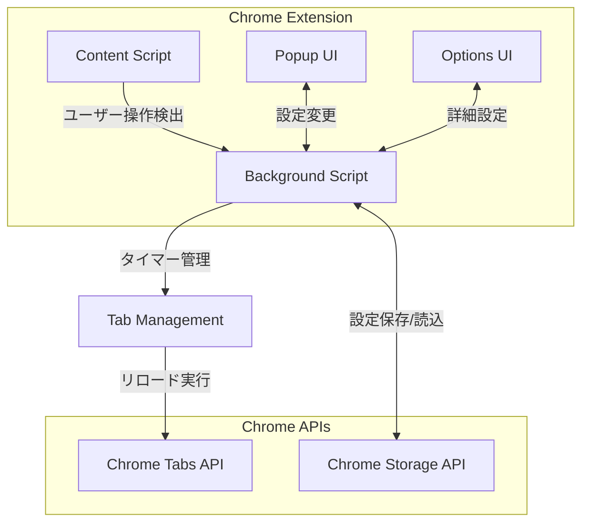

# 🛠️ DEVELOPMENT.md

Auto Reload Idle Tab Chrome拡張機能の開発者向けドキュメント

## 🏗️ プロジェクト構造

```
AutoReloadIdleTab/
├── manifest.json          # 拡張機能マニフェスト（Manifest V3）
├── background.js          # Service Worker（メイン処理）
├── content.js            # Content Script（ページ監視）
├── popup.html            # ポップアップHTML
├── popup.js              # ポップアップロジック
├── popup.css             # ポップアップスタイル
├── options.html          # 設定ページHTML
├── options.js            # 設定ページロジック
├── options.css           # 設定ページスタイル
├── icons/                # アイコンファイル
│   ├── icon16.png        # 16x16 PNG（ツールバー）
│   ├── icon48.png        # 48x48 PNG（管理画面）
│   └── icon128.png       # 128x128 PNG（Chrome Web Store）
├── README.md             # ユーザー向けドキュメント
├── DEVELOPMENT.md        # 開発者向けドキュメント
└── WORK.md               # 作業ログ（一時的）
```

## 🔧 開発環境の設定

### 必要なツール

- **Chrome Browser**: 最新版（推奨）
- **テキストエディタ**: VSCode, Cursor, WebStorm等
- **Git**: バージョン管理
- **Node.js**: 開発ツール（オプション）
- **画像エディタ**: アイコン作成用（オプション）

### 開発環境構築手順

1. **リポジトリのクローン**
   ```bash
   git clone https://github.com/jkabutaro/AutoReloadIdleTab.git
   cd AutoReloadIdleTab
   ```

2. **依存関係の確認**
   ```bash
   # 必要なファイルの存在確認
   ls -la icons/icon*.png
   ls -la *.html *.js *.css manifest.json
   ```

3. **Chromeでの読み込み**
   ```
   1. chrome://extensions/ を開く
   2. 右上の「開発者モード」を有効化
   3. "パッケージ化されていない拡張機能を読み込む"でフォルダを選択
   4. 拡張機能が正常に読み込まれることを確認
   ```

## 🏛️ アーキテクチャ設計

### システム構成図



### コンポーネント詳細

#### 1. Background Script (background.js)
- **役割**: メインの制御ロジック
- **機能**:
  - タブのアイドル時間管理
  - 自動リロードの実行
  - 設定の管理
  - 他コンポーネントとの通信

#### 2. Content Script (content.js)
- **役割**: ページ内のユーザー操作監視
- **機能**:
  - マウス、キーボード、スクロール等の検出
  - アクティビティのデバウンス処理
  - Background Scriptへの通知

#### 3. Popup UI (popup.html/js/css)
- **役割**: 簡易設定インターフェース
- **機能**:
  - ON/OFF切り替え
  - 基本的なアイドル時間設定
  - 現在のタブ状態表示
  - 手動操作（リロード、リセット）

#### 4. Options UI (options.html/js/css)
- **役割**: 詳細設定インターフェース
- **機能**:
  - 除外サイト管理
  - サイト別設定
  - 設定のインポート/エクスポート
  - デバッグモード

### データフロー

1. **アクティビティ検出フロー**
   ```
   ユーザー操作 → Content Script → Background Script → タイマーリセット
   ```

2. **自動リロードフロー**
   ```
   タイマー満了 → Background Script → Chrome Tabs API → タブリロード
   ```

3. **設定管理フロー**
   ```
   UI操作 → Popup/Options → Background Script → Chrome Storage API
   ```

## 🔧 最近の重要な修正

### Extension Context Invalidated エラー対応

**問題**: Chrome拡張機能のリロード時に発生する「Extension context invalidated」エラー

**解決策**:
```javascript
// エラーハンドリングの追加
chrome.runtime.sendMessage({ type: 'userActivity' }, (response) => {
  if (chrome.runtime.lastError) {
    if (chrome.runtime.lastError.message.includes('Extension context invalidated')) {
      // イベントリスナーを削除してスクリプトを無効化
      activityEvents.forEach(eventType => {
        document.removeEventListener(eventType, reportActivity, { 
          passive: true, 
          capture: true 
        });
      });
      return;
    }
  }
});

// コンテキスト有効性チェック関数
function isExtensionContextValid() {
  try {
    return chrome.runtime && chrome.runtime.id;
  } catch (error) {
    return false;
  }
}
```

### 楽天証券自動ログアウト制御の強化

**問題**: チェックボックスのクリックだけでは楽天証券の自動ログアウト機能が完全にOFFにならない

**解決策**: 包括的な制御アプローチ
```javascript
const disableAutoLogout = () => {
  try {
    if (typeof $ !== 'undefined' && typeof $.cookie === 'function') {
      // 1. グローバル変数の設定
      if (typeof window.autoLogoutUsed !== 'undefined') {
        window.autoLogoutUsed = true;
      }
      
      // 2. Cookieで状態を保存
      if (typeof window.autoLogoutStsCookieKey !== 'undefined') {
        $.cookie(window.autoLogoutStsCookieKey, "0");
      }
      
      // 3. 自動ログアウト設定をfalseに
      if (typeof window.autoLogout !== 'undefined') {
        window.autoLogout = false;
      }
      
      // 4. UIの更新
      $('#changeAutoLogout').prop("checked", false);
      $("a[id^='changeAutoLogout']").attr("id", "member-top-btn-automatic-logout");
      
      // 5. タイマーのリセット
      if (typeof window.reloadtime !== 'undefined') {
        window.reloadtime = +new Date(0);
      }
      
      // 6. タイマーループの再開
      if (typeof window.refreshTimerLoop === 'function') {
        window.refreshTimerLoop();
      }
      
      return true;
    }
  } catch (error) {
    console.error('楽天証券自動ログアウト設定エラー:', error);
  }
  return false;
};
```

**改善点**:
- jQueryの利用可能性チェック
- 複数のグローバル変数とCookieの同期制御
- フォールバック機能の実装
- エラーハンドリングの強化

## 💾 データ構造

### 設定オブジェクト（Storage）

```javascript
const DEFAULT_SETTINGS = {
  enabled: true,                    // 機能の有効/無効
  idleTime: 5,                     // デフォルトアイドル時間（分）
  excludedSites: [],               // 除外サイトパターン配列
  siteSpecificSettings: {},        // サイト別設定オブジェクト
  debugMode: false                 // デバッグモード
};

// 除外サイト例
excludedSites: [
  "*youtube.com*",
  "*music.*",
  "chrome://*"
]

// サイト別設定例
siteSpecificSettings: {
  "*news.com*": 3,      // 3分
  "*dashboard.*": 1,    // 1分
  "*blog.*": 10         // 10分
}
```

### タブ管理オブジェクト（Memory）

```javascript
const tabIdleData = new Map(); // Map<tabId, TabData>

interface TabData {
  lastActivity: number;  // 最後のアクティビティ時刻（Date.now()）
  timer: number | null;  // setTimeout()のタイマーID
}
```

## 🔌 Chrome Extensions API

### 使用している主要API

#### Tabs API
```javascript
// タブ情報の取得
chrome.tabs.query({ active: true, currentWindow: true })

// タブのリロード
chrome.tabs.reload(tabId)

// タブイベントの監視
chrome.tabs.onActivated.addListener((activeInfo) => {})
chrome.tabs.onUpdated.addListener((tabId, changeInfo, tab) => {})
chrome.tabs.onRemoved.addListener((tabId) => {})
```

#### Storage API
```javascript
// 設定の読み込み
chrome.storage.sync.get(DEFAULT_SETTINGS)

// 設定の保存
chrome.storage.sync.set(settings)
```

#### Runtime API
```javascript
// メッセージ送信
chrome.runtime.sendMessage({ type: 'userActivity' })

// メッセージ受信
chrome.runtime.onMessage.addListener((message, sender, sendResponse) => {})
```

### 権限の詳細

```json
{
  "permissions": [
    "activeTab",      // 現在のタブ情報取得
    "tabs",          // タブ操作とイベント監視
    "storage"        // 設定の永続化
  ]
}
```

## 🧪 テスト・デバッグ

### 手動テスト手順

#### 1. 基本機能テスト
```
✅ 拡張機能の有効化/無効化
✅ アイドル時間設定（1-60分）
✅ 手動リロード機能
✅ タイマーリセット機能
✅ ポップアップの表示・操作
✅ 設定の永続化
```

#### 2. 除外サイトテスト
```
✅ 除外パターンの追加/削除
✅ ワイルドカードパターンのマッチング
✅ システムページ（chrome://）の自動除外
✅ 複数パターンの組み合わせ
```

#### 3. サイト別設定テスト
```
✅ サイト別アイドル時間設定
✅ パターンの優先度確認
✅ 設定の上書き・削除
```

#### 4. データ管理テスト
```
✅ 設定のエクスポート（JSON形式）
✅ 設定のインポート（妥当性検証含む）
✅ 設定のリセット
✅ 不正なJSONファイルの処理
```

### デバッグ方法

#### 1. Background Scriptのデバッグ
```
1. chrome://extensions/ を開く
2. 拡張機能の「Service Workerを調査」をクリック
3. DevToolsのConsoleタブでログを確認
4. Sourcesタブでブレークポイント設定
```

#### 2. Content Scriptのデバッグ
```
1. 対象ページでF12を押しDevToolsを開く
2. Consoleタブでログを確認
3. Sourcesタブでcontent.jsのブレークポイント設定
4. Networkタブで通信状況を確認
```

#### 3. UI（Popup/Options）のデバッグ
```
1. ポップアップを右クリック→「検証」
2. DevToolsでHTML/CSS/JSをデバッグ
3. Console.logでの状態確認
```

#### 4. デバッグログの活用
```javascript
// デバッグモード時のログ出力
if (settings.debugMode) {
  console.log('[AutoReload]', 'Debug info:', data);
}
```

### パフォーマンステスト

#### 1. メモリ使用量
```
1. chrome://task-manager/ でメモリ使用量確認
2. 長時間使用後のメモリリーク確認
3. 大量タブでの動作確認
```

#### 2. CPU使用率
```
1. DevToolsのPerformanceタブで測定
2. ユーザー操作時のCPU使用量確認
3. バックグラウンド処理の負荷確認
```

## 🚀 ビルド・リリース

### 開発ビルド
```bash
# ファイルの整合性確認
npm run validate  # package.jsonがある場合

# または手動確認
ls -la manifest.json *.html *.js *.css icons/icon*.png
```

### 本番ビルド手順

1. **コードの最適化**
   ```javascript
   // console.logの削除またはコメントアウト
   // デバッグ用コードの削除
   // 不要なコメントの削除
   ```

2. **設定の確認**
   ```json
   // manifest.jsonの確認
   {
     "version": "1.0.0",           // バージョン更新
     "name": "Auto Reload Idle Tab", // 正式名称
     "description": "..."          // 適切な説明
   }
   ```

3. **ファイル圧縮**
   ```bash
   # Chrome Web Store用のzipファイル作成
   zip -r AutoReloadIdleTab-v1.0.0.zip . \
     -x "*.git*" "*.md" "WORK.md" "node_modules/*" "*.log"
   ```

4. **最終テスト**
   ```
   ✅ 圧縮ファイルからの再インストールテスト
   ✅ 全機能の動作確認
   ✅ 異なるChrome環境でのテスト
   ```

### Chrome Web Store公開

1. **開発者アカウント準備**
   - Chrome Web Store Developer Account（$5登録料）
   - Google Payments情報の設定

2. **必要素材の準備**
   ```
   ✅ アプリケーションzip（2MB以下）
   ✅ アイコンファイル（128x128px）
   ✅ スクリーンショット（1280x800px、最大5枚）
   ✅ プロモーション画像（440x280px、オプション）
   ✅ プライバシーポリシー（必須）
   ```

3. **申請・審査**
   - 審査期間：通常1-3営業日
   - セキュリティチェック
   - 機能チェック

## 🔧 トラブルシューティング（開発者向け）

### よくある開発時の問題

**Q: Service Workerが起動しない**
```
A: 以下を確認：
   ✅ manifest.jsonのbackground.service_workerパス
   ✅ background.jsの構文エラー
   ✅ chrome://extensions/でエラー表示確認
```

**Q: Content Scriptが動作しない**
```
A: 以下を確認：
   ✅ manifest.jsonのcontent_scripts設定
   ✅ matchesパターンの正確性
   ✅ run_atタイミングの適切性
   ✅ 対象ページでのエラー確認
```

**Q: メッセージング通信が失敗する**
```
A: 以下を確認：
   ✅ sendResponseの適切な呼び出し
   ✅ 非同期処理でのreturn true
   ✅ メッセージ形式の一致
   ✅ 送信タイミングの確認
```

**Q: ストレージアクセスエラー**
```
A: 以下を確認：
   ✅ manifest.jsonのstorage権限
   ✅ chrome.storage.syncの容量制限
   ✅ JSONシリアライズ可能なデータ
   ✅ 同期の完了待ち
```

**Q: タブAPIエラー**
```
A: 以下を確認：
   ✅ tabs権限の設定
   ✅ タブIDの有効性
   ✅ システムページへのアクセス制限
   ✅ 権限不足によるエラー
```

### パフォーマンス最適化

#### 1. メモリ使用量削減
```javascript
// 不要なイベントリスナーの削除
window.removeEventListener('beforeunload', handler);

// Map/Setの適切なクリーンアップ
tabIdleData.delete(tabId);

// 大きなオブジェクトの参照削除
largeObject = null;
```

#### 2. CPU使用率削減
```javascript
// デバウンス処理の実装
const debouncedFunction = debounce(originalFunction, 200);

// パッシブイベントリスナーの使用
document.addEventListener('scroll', handler, { passive: true });

// 効率的なタイマー管理
clearTimeout(existingTimer);
```

#### 3. ストレージ最適化
```javascript
// 差分更新の実装
const changes = { specific_key: new_value };
chrome.storage.sync.set(changes);

// 不要データの削除
delete settings.obsolete_setting;
```

## 📈 機能拡張ガイド

### 新機能追加の手順

1. **機能設計**
   ```
   ✅ 機能仕様の明確化
   ✅ UIデザインの作成
   ✅ データ構造の設計
   ✅ APIの選定
   ```

2. **実装**
   ```
   ✅ コア機能の実装
   ✅ UI実装
   ✅ テストケースの作成
   ✅ ドキュメント更新
   ```

3. **テスト**
   ```
   ✅ 単体テスト
   ✅ 統合テスト
   ✅ ユーザビリティテスト
   ✅ パフォーマンステスト
   ```

### コーディング規約

#### JavaScript
```javascript
// ES6+ 構文を使用
const settings = await loadSettings();

// async/awaitを推奨
async function processData() {
  try {
    const result = await apiCall();
    return result;
  } catch (error) {
    console.error('Error:', error);
  }
}

// 適切なエラーハンドリング
chrome.tabs.get(tabId).catch(error => {
  if (error.message.includes('No tab with id')) {
    tabIdleData.delete(tabId);
  }
});
```

#### CSS
```css
/* BEM記法を推奨 */
.popup__button--primary {
  background-color: #667eea;
}

/* CSS Grid/Flexboxを活用 */
.container {
  display: grid;
  grid-template-columns: 1fr 2fr;
  gap: 16px;
}

/* レスポンシブ対応 */
@media (max-width: 600px) {
  .container {
    grid-template-columns: 1fr;
  }
}
```

#### HTML
```html
<!-- セマンティックHTMLを使用 -->
<main role="main">
  <section aria-labelledby="settings-title">
    <h2 id="settings-title">設定</h2>
  </section>
</main>

<!-- アクセシビリティ対応 -->
<button aria-label="設定を保存" type="button">
  保存
</button>
```

## 🤝 コントリビューション

### プルリクエストの手順

1. **フォーク・ブランチ作成**
   ```bash
   git fork https://github.com/jkabutaro/AutoReloadIdleTab.git
   git checkout -b feature/new-feature
   ```

2. **実装・テスト**
   ```bash
   # 実装
   # テスト実行
   # ドキュメント更新
   ```

3. **プルリクエスト作成**
   ```
   ✅ 明確なタイトルと説明
   ✅ 変更内容の詳細
   ✅ テスト結果の報告
   ✅ スクリーンショット（UI変更の場合）
   ```

### コードレビューの観点

- **機能性**: 仕様通りの動作をするか
- **セキュリティ**: 権限の適切な使用、XSS対策
- **パフォーマンス**: メモリ・CPU使用量の最適化
- **保守性**: コードの可読性、適切なコメント
- **テスト**: 十分なテストカバレッジ

## 📞 開発者向けサポート

### 質問・報告の場所

- **技術質問**: [GitHub Discussions](https://github.com/jkabutaro/AutoReloadIdleTab/discussions)
- **バグ報告**: [GitHub Issues](https://github.com/jkabutaro/AutoReloadIdleTab/issues)
- **機能要望**: [GitHub Issues](https://github.com/jkabutaro/AutoReloadIdleTab/issues)（enhancement label）

### 報告時に含める情報

```
✅ Chrome版本
✅ OS情報
✅ 拡張機能バージョン
✅ 再現手順
✅ 期待される動作
✅ 実際の動作
✅ エラーメッセージ
✅ コンソールログ
```

---

**開発に関する質問やフィードバックをお待ちしています！** 